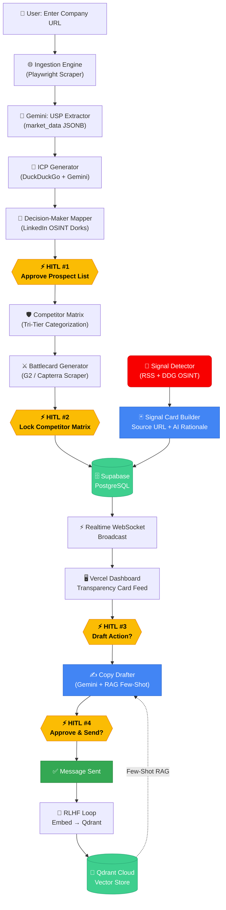
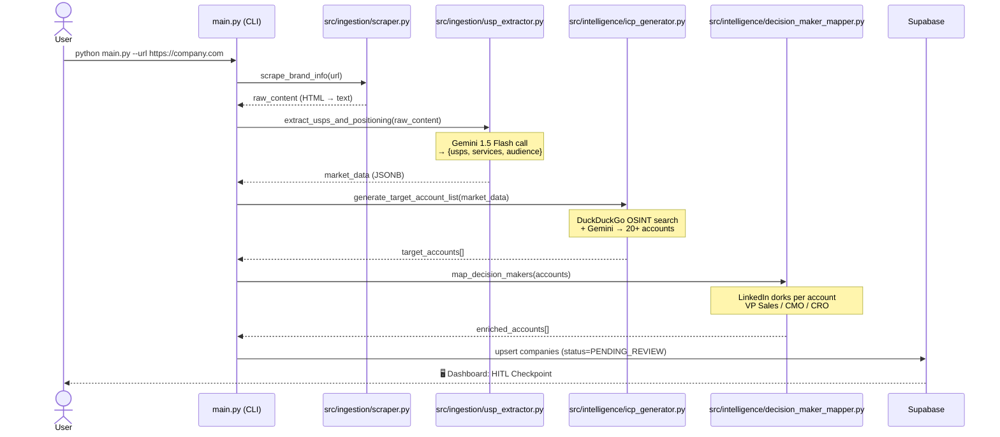
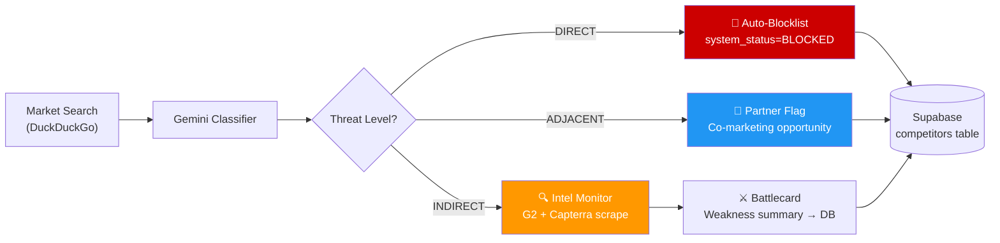
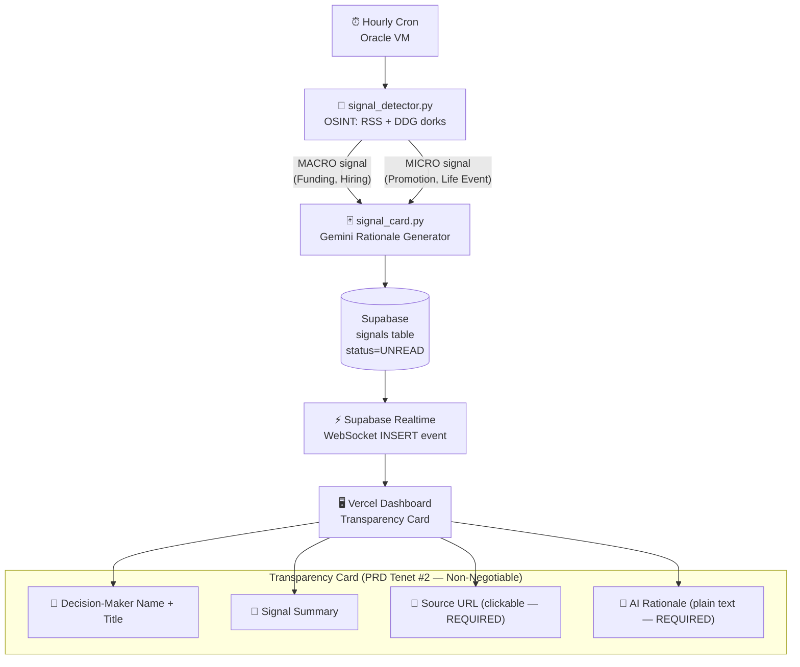
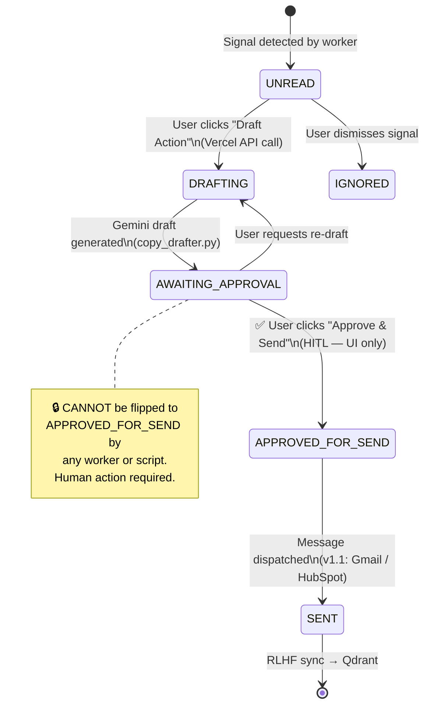
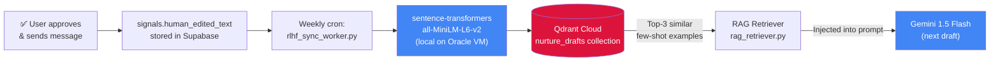

<div align="center">


# 🎯 Project Signal
### Autonomous B2B Relationship Nurturing & Signal Intelligence Platform


---

[](https://www.python.org/)
[](https://ai.google.dev/)
[](https://supabase.com/)
[](https://qdrant.tech/)
[](https://vercel.com/)
[](https://www.oracle.com/cloud/)
[](LICENSE)
[](https://github.com/CapAmin22/Signal.AI/actions)

> **⚠ CONFIDENTIAL — Internal Use Only.** This repository and all its contents are proprietary and classified. Access restricted to authorized team members under NDA. See [LICENSE](LICENSE).

</div>

---

## 📌 Executive Summary

Project Signal is a **zero-cost, serverless, event-driven** autonomous B2B sales nurturing engine. It replaces the broken "spray and pray" cold outreach model with a **relationship-first intelligence layer** that:

- 🔍 Transforms a single company URL into an exhaustive prospect + decision-maker map
- 🛡 Builds a live competitive Defensive Matrix (auto-blocklist + battlecards)
- 📡 Monitors decision-makers 24/7 for life events, promotions, and company signals
- 🃏 Surfaces each signal as a **Transparency Card** — with a clickable source and AI rationale
- ✍️ Drafts relationship-first messages using **Gemini + RAG** — but **never sends without human approval**

**Human-in-the-Loop (HITL) is protected at the architecture level, not just the UI.**

---

## 🏗 System Architecture

### High-Level Infrastructure

```
┌─────────────────────────────────────────────────────────────────────┐
│                        PROJECT SIGNAL STACK                         │
├─────────────────┬───────────────────────────────────────────────────┤
│  LAYER          │  TECHNOLOGY                      │  COST          │
├─────────────────┼──────────────────────────────────┼────────────────┤
│  Edge / UI      │  Vercel (Next.js Hobby)           │  $0/mo         │
│  Heavy Compute  │  Oracle Cloud ARM VM (4 OCPU)    │  $0/mo (Always Free) │
│  Relational DB  │  Supabase PostgreSQL + Realtime  │  $0/mo (500MB) │
│  Vector Store   │  Qdrant Cloud (RLHF)             │  $0/mo (1 GB)  │
│  AI Engine      │  Gemini 1.5 Flash API            │  $0/mo (15 RPM)│
├─────────────────┴──────────────────────────────────┴────────────────┤
│                    TOTAL MONTHLY INFRASTRUCTURE COST: $0            │
└─────────────────────────────────────────────────────────────────────┘
```

### Full Pipeline Data Flow



---

## 📋 Module Breakdown

### Module 1 — Deep Market & Lead Generation Engine



---

### Module 2 — Defensive Matrix (Competitor Intelligence)



---

### Module 3 — Nurturing Dashboard & Signal Flow



---

### Module 4 — Supervised Drafting (HITL State Machine)



---

### RLHF Progressive Autonomy Loop



---

## 🗺️ Roadmap

| Phase | Version | Status | Key Deliverables |
|---|---|---|---|
| **MVP** | `v1.0` | 🔨 **IN DEVELOPMENT** | URL ingestion · ICP + DM mapping · Competitor matrix · Signal detection · Transparency Cards · AI drafting (copy/paste) |
| **Workflow** | `v1.1` | 📋 Planned | Brand Nurture Calendar · HubSpot/Salesforce API · Gmail/Outlook direct send · Deeper OSINT signals |
| **Autonomy** | `v2.0` | 🔮 Future | Progressive Autonomy · Auto-send when AI confidence ≥ threshold · Full RLHF tone matching |

---

## ⚡ Quick Start (Authorized Engineers Only)

> Before you begin: ensure you have signed the NDA and received credentials from the project lead.

### 1. Clone

```bash
git clone https://github.com/CapAmin22/Signal.AI.git
cd Signal.AI
```

### 2. Environment

```bash
python -m venv venv
venv\Scripts\activate        # Windows
# source venv/bin/activate    # macOS/Linux

pip install -r requirements.txt
playwright install chromium
```

### 3. Configure secrets

```bash
cp .env.example .env
# Fill in all values — see .env.example for documentation on each key
```

### 4. Initialize database

```sql
-- Run in Supabase Dashboard > SQL Editor
-- File: database/schema.sql
```

### 5. Run the pipeline

```bash
python main.py --url https://yourcompany.com
```

### 6. Deploy workers on Oracle VM

```bash
# See DEVELOPMENT.md for full Oracle VM setup guide
python workers/signal_worker.py       # Test run (normally cron'd hourly)
python workers/healthcheck_worker.py  # Test Supabase connection
```

**→ See [DEVELOPMENT.md](DEVELOPMENT.md) for the complete engineer onboarding guide.**

---

## 🗂 Repository Structure

```
Signal.AI/
│
├── 📄 README.md                    ← You are here
├── 📄 ARCHITECTURE.md              ← Deep-dive 5-layer technical reference
├── 📄 DEVELOPMENT.md               ← Engineer onboarding & local dev guide
├── 📄 CONTRIBUTING.md              ← Code standards & HITL rules for contributors
├── 📄 SECURITY.md                  ← GDPR/CCPA policy & responsible disclosure
├── 📄 LICENSE                      ← PROPRIETARY & CONFIDENTIAL
│
├── ⚙️  main.py                      ← CLI entry point (4-stage pipeline)
├── 📦 requirements.txt             ← All Python dependencies
├── 🔑 .env.example                 ← Environment variable template
│
├── 📁 config/
│   └── settings.py                 ← Pydantic BaseSettings (typed env loading)
│
├── 📁 database/
│   ├── schema.sql                  ← Supabase PostgreSQL DDL (full schema)
│   └── migrations/001_initial.sql  ← Idempotent first migration
│
├── 📁 docs/
│   └── flows/                      ← Draw.io source files for all flow diagrams
│
├── 📁 src/
│   ├── ingestion/                  ← Module 1-A: URL ingestion
│   │   ├── scraper.py              ← Playwright async scraper
│   │   └── usp_extractor.py        ← Gemini USP/positioning extraction
│   │
│   ├── intelligence/               ← Module 1-B: ICP & decision-maker mapping
│   │   ├── icp_generator.py        ← TAL generation (DDG + Gemini)
│   │   └── decision_maker_mapper.py← LinkedIn OSINT dorks
│   │
│   ├── signals/                    ← Module 3-A: Signal detection & rationale
│   │   ├── signal_detector.py      ← RSS feeds + DuckDuckGo OSINT
│   │   └── signal_card.py          ← Transparency Card builder (source + rationale)
│   │
│   ├── competitors/                ← Module 2: Defensive Matrix
│   │   ├── matrix_builder.py       ← Tri-tier categorization
│   │   └── battlecard_generator.py ← G2/Capterra weakness extraction
│   │
│   ├── enrichment/                 ← Contact enrichment (zero-cost)
│   │   └── email_verifier.py       ← SMTP handshake (no Apollo/Hunter needed)
│   │
│   ├── drafting/                   ← Module 4: Supervised execution
│   │   ├── prompt_builder.py       ← Anti-pitch prompt architecture
│   │   └── copy_drafter.py         ← HITL-gated Gemini copy generation
│   │
│   ├── rlhf/                       ← Progressive Autonomy (v2.0)
│   │   ├── embedder.py             ← all-MiniLM-L6-v2 local embedding
│   │   ├── qdrant_sync.py          ← Qdrant Cloud vector push + GDPR delete
│   │   └── rag_retriever.py        ← Few-shot RAG for Gemini prompts
│   │
│   ├── models/
│   │   └── schemas.py              ← Pydantic v2 models (Company, Signal, etc.)
│   │
│   └── utils/
│       ├── database.py             ← Supabase client + state machine helpers
│       ├── rate_limiter.py         ← Gemini 15 RPM enforcer
│       └── logger.py               ← Structured JSON logger (stdlib only)
│
├── 📁 workers/                     ← Oracle VM cron scripts
│   ├── signal_worker.py            ← Hourly: OSINT detection + Gemini enrichment
│   ├── rlhf_sync_worker.py         ← Weekly: embed → push to Qdrant
│   └── healthcheck_worker.py       ← 2x/week: Supabase keep-alive
│
└── 📁 .github/
    ├── workflows/ci.yml            ← Ruff lint + mypy + schema validation
    └── ISSUE_TEMPLATE/             ← Bug report + Feature request templates
```

---

## 📊 KPI Targets

| Metric | Description | Target |
|---|---|---|
| **Signal Action Rate** | % of signals where user clicks "Draft Action" | **> 35%** |
| **HITL Acceptance Rate** | % of AI drafts approved without major edits | **> 80%** |
| **Pipeline Velocity** | Time from "Identified" → "First Positive Reply" | **Minimize** |

---

## 🔐 Security & Compliance

- **Public data only** — signals sourced exclusively from content decision-makers posted publicly
- **GDPR/CCPA** — hard-delete cascades across Supabase AND Qdrant vector store simultaneously
- **HITL architecture** — no external message can leave the system without explicit user approval
- **Gemini RPM guard** — rate limiter prevents runaway API costs and 429 crashes
- **SMTP rate limit** — max 10 pings/domain/hour to protect Oracle VM IP reputation

→ Full policy in [SECURITY.md](SECURITY.md)

---

## ⚠ Confidentiality Notice

This repository is **PROPRIETARY AND CONFIDENTIAL**. All code, architecture, documentation, and data contained herein are trade secrets of the copyright holder.

Unauthorized access, copying, distribution, or use is strictly prohibited and may result in civil and criminal penalties. By accessing this repository you confirm you are an authorized team member operating under a valid NDA.

**© 2026 Amin — Project Signal. All rights reserved.**
